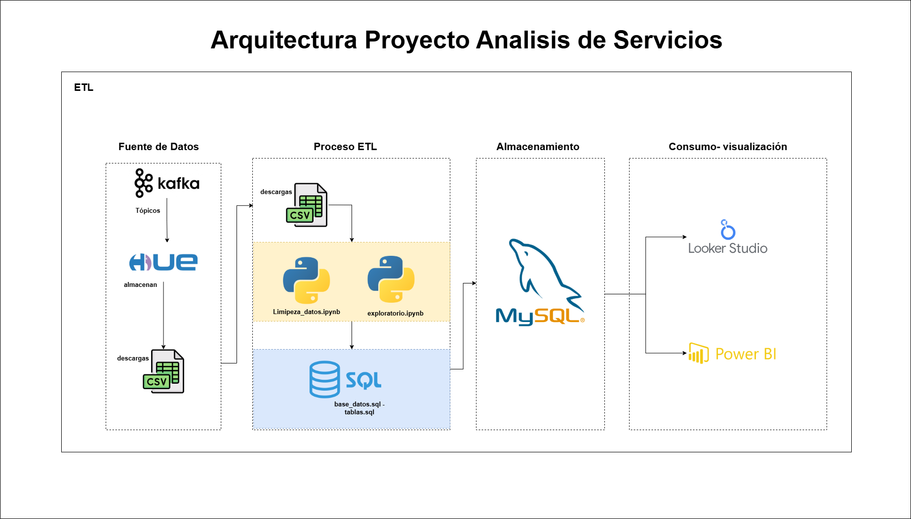

# Proyecto ETL: Inventario de Servicios y APIs

Este proyecto realiza un proceso ETL (Extracción, Transformación y Carga) para integrar y analizar datos de servicios de integración (APIs, adaptadores, servicios backend) desplegados en producción, con el objetivo de mejorar la visibilidad operativa, detectar errores y facilitar la toma de decisiones a través de herramientas como Looker Studio y Power BI.

---


# 🎯 Objetivo
Realizar un análisis descriptivo y visual de los servicios de integración en producción, consolidando datos desde OpenSearch y entregables del equipo COES, con enfoque en:

- Distribución de plataformas
- Herramientas de desarrollo utilizadas
- Transacciones y errores frecuentes
- Segmentación por categoría de servicio

## 📁 Estructura del Proyecto

```bash
├── Analisis_EDA/
├── Files/
│ ├── Inventario de Servicios y Apis Producción.xlsx
│ └── opensearch_filtrado.csv
│ ├── Opensearch.xlsx
│ └── inventario_servicios_apis.csv
├── img/
│ ├── udea.png
│ └── base_datos.png
├── Reports/
│ ├── Analisis_EDA_Opensearch.html
│ └── Analisis_EDA_servicios_apis.html
├── SQL/
│ ├── base_datos.sql
│ ├── tablas.sql
│ └── database.sql
├── exploratorio.ipynb
├── limipieza_datos.ipynb
├── README.md
```

# Arquitectura


---

## 🚀 Flujo ETL

### 1. Extracción
Se cargan los datos desde archivos CSV ubicados en la carpeta `datos/`.

### 2. Transformación
- Se renombran y seleccionan columnas clave.
- Se normaliza un campo común (`nombre_clave`) para permitir el enlace entre los dos conjuntos de datos (remoción de acentos, espacios y símbolos).
- Se validan tipos de datos y se manejan valores nulos.

### 3. Carga
- Se crea la base de datos `inventario_datos` (si no existe).
- Se crean las tablas `inventario_servicios_apis` y `opensearch_filtrado`.
- Se insertan los datos limpios en las tablas.
- Se establece una clave de relación (`nombre_clave`) para facilitar consultas conjuntas.

---

## 🧰 Requisitos

- Python 3.11+
- MySQL
- Librerias Python:
  - pandas
  - mysql-connector-python
  - unidecode
  - ydata-profiling
  - py4j
  - ipywidgets

Instala los paquetes necesarios:

```bash
pip install pandas mysql-connector-python unidecode, etc
```
---

## 🚀 Flujo ETL

### 1. Extracción

Se cargan los datos desde archivos CSV ubicados en la carpeta `datos/`.

### 2. Transformación

- Se renombran y seleccionan columnas clave.
- Se normaliza un campo común (`nombre_clave`) para permitir el enlace entre los dos conjuntos de datos (remoción de acentos, espacios y símbolos).
- Se validan tipos de datos y se manejan valores nulos.

### 3. Carga

- Se crea la base de datos `inventario_datos` (si no existe).
- Se crean las tablas `inventario_servicios_apis` y `opensearch_filtrado`.
- Se insertan los datos limpios en las tablas.
- Se establece una clave de relación (`nombre_clave`) para facilitar consultas conjuntas.

---

## 🧰 Requisitos

### ⚙️ Configuración de Base de Datos

```bash
mysql -u root -p < scripts/base_datos.sql
```

Ejecuta el script tablas.sql para crear las tablas:
```bash
mysql -u root -p inventario_datos < scripts/tablas.sql
```

### 🔐 Conexión externa para Looker Studio
Para permitir acceso a Looker Studio de forma segura:

Crea un usuario limitado en MySQL:

```bash
CREATE USER 'usuario_looker'@'%' IDENTIFIED BY 'password.123';
GRANT SELECT ON inventario_datos.* TO 'usuario_looker'@'%';
FLUSH PRIVILEGES;
```

✍️ Autores
Andrea Estefania Hernandez, Daniel Alvarez, Leandro Rivera Ríos, Luz Marina Getial, 
Proyecto desarrollado en el contexto de integración de datos corporativos para análisis y visualización de consumo de APIs y servicios.
